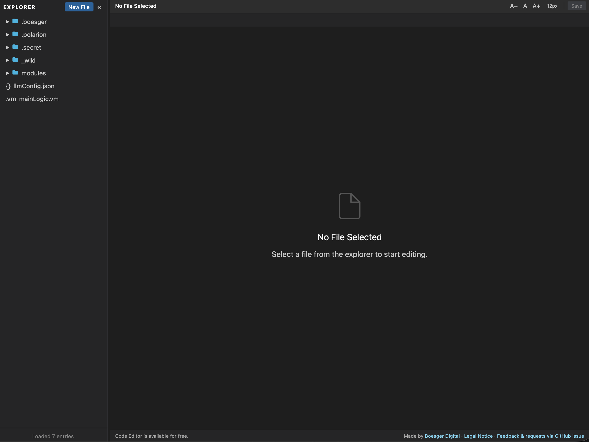
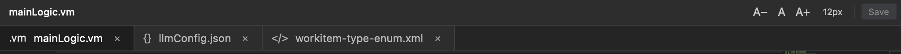
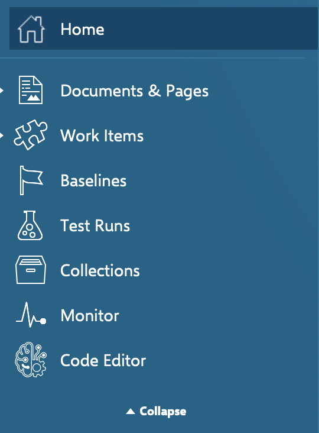

# Polarion Code Editor

A **VS Code-like file editor** built right into Polarion ALM — edit Velocity macros, JSON configs, XML enumerations, and any other text-based repository file without ever leaving Polarion.

> **Free to use** — no license key, no paywall, no feature limitations. Licensed under the terms in the LICENSE file.

---

## Table of Contents

- [What Is This?](#what-is-this)
- [Compatibility Policy](#compatibility-policy)
- [Screenshots](#screenshots)
- [Installation](#installation)
- [Usage](#usage)
- [REST API](#rest-api)
- [Permissions](#permissions)
- [Navigation Tab in User View](#navigation-tab-in-user-view)
- [Bugs, Features & Questions](#bugs-features--questions)
- [Contributing](#contributing)
- [Branding & Legal Notice](#branding--legal-notice)
- [License](#license)

---

<div style="page-break-before: always;"></div>

## What Is This?

The **Polarion Code Editor** is a server-side OSGi plugin for Polarion ALM that adds a full-featured code editor to the Polarion Administration panel. It uses the same [Monaco Editor](https://microsoft.github.io/monaco-editor/) engine that powers VS Code, so you get syntax highlighting, a familiar dark theme, and keyboard shortcuts out of the box.

**Highlights:**

- Browse and edit files in the Polarion SVN repository directly in the browser.
- Syntax highlighting for `.json`, `.xml`, `.vm`, `.yaml`, `.sh`, `.md`, and more.
- Velocity template highlighting for `.vm`, `.vtl`, `.fhtml`, and `page.xml` files.
- Preview image files (`.png`, `.jpg`, `.jpeg`, `.gif`, `.svg`, `.webp`, `.bmp`, `.ico`) directly in the editor.
- Create, rename, and delete files — all via a simple file explorer sidebar.
- Project-aware: automatically scopes to the current Polarion project.
- Keyboard shortcuts (`Ctrl+S` / `Cmd+S` to save).
- Warns before you navigate away with unsaved changes.
- Movable tabs — drag and drop persistent tabs to reorder them in the tab bar.
- No additional server, database, or cloud service required.

## Important Legal Note

- This plugin is licensed under the [Apache License 2.0](LICENSE).
- You are free to use, modify, and distribute it — including in your own projects — subject to the Apache 2.0 terms.

---

<div style="page-break-before: always;"></div>

## Compatibility Policy

**Minimum supported versions: Polarion 2512 / Java 21**

This plugin requires **Polarion 2512 or later** and **Java 21 or later**. Older versions of Polarion and Java are explicitly not supported, and there are no plans to backport compatibility.

### Why not older versions?

Technically, supporting older Polarion releases (e.g., those still running Java 17) would not require significant effort. However, this is a **deliberate design decision**:

- This is a new plugin built on a freshly set up build pipeline. Starting with legacy constraints from day one adds unnecessary overhead without any meaningful benefit.
- The strategy is **not** to always chase the absolute latest Polarion release, but to **anchor to the current Java LTS version** (Java 21) and maintain that baseline going forward.
- Polarion 2512 may feel recent today — but within a few months it will be mainstream across most production deployments, and the version gap will naturally disappear.

If you are still on an older Polarion version, the recommended path is to upgrade your Polarion installation rather than waiting for a backport.

---

<div style="page-break-before: always;"></div>

## Screenshots

### Code Editor entry in the Polarion sidebar



### Multiple files open in tabs



### File explorer with repository structure



---

<div style="page-break-before: always;"></div>

## Installation

### Requirements

| Requirement  | Version         |
| ------------ | --------------- |
| Polarion ALM | 2512 or later   |
| Java         | JDK 21 or later |

### 1. Deploy to Polarion

Copy the JAR into your Polarion plugins directory:

```bash
cp target/boesger.polarion.code-editor-*.jar <POLARION_HOME>/polarion/plugins/
```

Then **restart the Polarion server**.

### 2. Verify

After restarting, open Polarion and look for the **Code Editor** entry in the left-hand navigation sidebar (see screenshot above). If it appears, the plugin is active.

---

<div style="page-break-before: always;"></div>

## Usage

### Opening the Editor

Navigate to **Polarion Administration → Code Editor** (or click the Code Editor entry in the main sidebar). The editor opens in the context of the current project (or globally if accessed from the Administration panel).

### Editing a File

1. Browse the **file explorer** on the left to find the file you want to edit.
2. Click the file to open it in the editor.
3. Make your changes.
4. Press **`Ctrl+S`** / **`Cmd+S`** or click the **Save** button in the top-right corner.

You can have multiple files open at once — they appear as tabs at the top of the editor. If you open more tabs than fit in the bar, a thin horizontal scrollbar appears below the tabs. Persistent tabs (opened by double-clicking a file) can be reordered by dragging and dropping them within the tab bar.

### Viewing an Image File

Click any image file (`.png`, `.jpg`, `.jpeg`, `.gif`, `.svg`, `.webp`, `.bmp`, `.ico`) in the file explorer to open it in the built-in image viewer. The image is displayed centered and scaled to fit the editor area. Image tabs are read-only — saving is disabled for them.

### Creating a New File

1. Click **New File** in the top-left of the explorer panel.
2. Enter a name or path (e.g., `config/myconfig.yaml`).
3. Press **Create**.

### Renaming a File

1. Hover over a file in the explorer.
2. Click the **pencil ✎** icon.
3. Enter the new name and confirm.

### Deleting a File

1. Hover over a file in the explorer.
2. Click the **✕** icon.
3. Confirm the deletion.

### Font Size

Use the **A−**, **A**, **A+** buttons in the toolbar to decrease, reset, or increase the editor font size.

---

<div style="page-break-before: always;"></div>

## REST API

The plugin exposes a REST API at `/polarion/code-editor/api/`. All endpoints require an authenticated Polarion session — unauthenticated requests receive HTTP 401.

### Endpoints

| Method   | Path                          | Description                        |
| -------- | ----------------------------- | ---------------------------------- |
| `GET`    | `/api/health`                 | Health check — returns `OK`        |
| `GET`    | `/api/config/list`            | List all files in the repository   |
| `GET`    | `/api/config/file/{filename}` | Read file content or download file |
| `GET`    | `/api/files/tree`             | Browse a directory tree            |
| `PUT`    | `/api/config/file/{filename}` | Save (create or update) a file     |
| `DELETE` | `/api/config/file/{filename}` | Delete a file                      |
| `POST`   | `/api/config/rename`          | Rename a file                      |

All write endpoints (`PUT`, `DELETE`, `POST`) accept an optional `projectId` query parameter to scope the operation to a specific Polarion project. Omit it for global (administration) scope.

### Downloading a file

`GET /api/config/file/{filename}` accepts a `download` query parameter. When set to `true`, the response includes a `Content-Disposition: attachment` header, which causes the browser to download the file rather than display it inline.

```
GET /polarion/code-editor/api/config/file/.file-editor/myconfig.json?projectId=MyProject&download=true
```

This is useful for scripted exports or CI pipelines that need to retrieve repository files via HTTP.

---

<div style="page-break-before: always;"></div>

## Permissions

The plugin currently does **not** define dedicated Polarion permissions yet.

- A dedicated permission model is planned for a future release.
- Until then, there is no separate `read`/`write` permission matrix provided by this plugin.

---

## Navigation Tab in User View

The plugin behaves differently in Administration and User View:

- The **Administration entry** is always visible.
- The **User View sidebar tab** is only visible when it is enabled in Polarion Topics configuration.

### How to enable it in User View

To show **Code Editor** in the User View sidebar, add the topic in Global Administration:

1. Go to **Global Administration → Portal → Topics**.
2. Edit the active topics XML.
3. Add this line inside `<topics>`:

```xml
<topic id="code-editor"/>
```

4. Save the configuration.

After saving, the Code Editor tab is available in User View.

---

<div style="page-break-before: always;"></div>

## Bugs, Features & Questions

| Channel | Purpose |
|---------|---------|
| [🐛 Bug Report](https://github.com/phillipboesger/polarion.code.editor/issues/new?template=bug_report.yml) | Something isn't working as expected |
| [💡 Feature Request](https://github.com/phillipboesger/polarion.code.editor/issues/new?template=feature_request.yml) | Suggest an idea or improvement |
| [❓ Q&A Discussion](https://github.com/phillipboesger/polarion.code.editor/discussions/categories/q-a) | Questions about installation, configuration, or usage |

When reporting a bug, please include your Polarion version, the plugin version, steps to reproduce, and any relevant error messages from the Polarion server log.

---

<div style="page-break-before: always;"></div>

## Contributing

Contributions are welcome — bug reports, feature ideas, and pull requests. See [CONTRIBUTING.md](CONTRIBUTING.md) for details on how to get started.

---

<div style="page-break-before: always;"></div>

## Branding & Legal Notice

The plugin includes subtle branding (a custom navigation icon and a footer attribution "Made by Boesger Digital") while remaining fully free. There is no paywall, no license key, and no feature limitation.

- Website: [https://digital.boesger.com](https://digital.boesger.com)
- Legal Notice: [https://digital.boesger.com/imprint/](https://digital.boesger.com/imprint/)

---

## License

Licensed under the [Apache License 2.0](LICENSE).

Copyright 2026 Phillip Bösger (digital@boesger.com)
